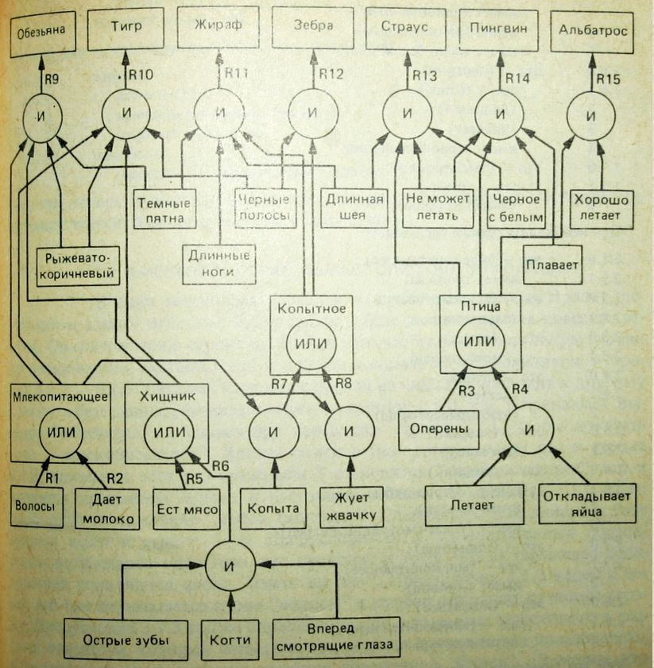

# Отчет по лабораторной работе
## по курсу "Искусственый интеллект"

### Студенты: 

| ФИО       | Роль в проекте                     | Оценка       |
|-----------|------------------------------------|--------------|
| Иванопуло | Реализовал оболочку ЭС на Прологе и описал общую схему предметной области |          |
| Петропуло | Инженер по знаниям, отвечал за диагностику левого колеса |       |
| Гин Ку Син| Диагностика правого колеса, тестирование |      |
| Галкина   | Написание отчёта |          |

## Результат проверки

| Преподаватель     | Дата         |  Оценка       |
|-------------------|--------------|---------------|
| Сошников Д.В. |              |               |

> *Комментарии проверяющих (обратите внимание, что более подробные комментарии возможны непосредственно в репозитории по тексту программы)*

## Тема работы

Опишите тему работы, включая выбранную предметную область для реализации экспертной системы.

## Концептуализация предметной области

Опишите результаты концептуализации предметной области:
 - выделенные понятия
 - связи между ними, тип получившейся онтологии (словарь, сеть, иерархия и т.д.)
 - опишите возможные статические и динамические знания
 - как предметная область может быть разделена между участниками для коллективного создания базы знаний 

Приведите графические иллюстрации:

## Принцип реализации системы

Опишите:
 - Какой механизм вывода вы предполагаете использовать и почему
 - Какую систему программирования вы предполагаете использовать и почему
 - Если это имеет смысл, приведите графическую иллюстрацию архитектуры системы. Если система состоит из разных частей (бот, механизм вывода) - опишите принципы интеграции

## Механизм вывода

Опишите, как работает механизм вывода. Наиболее интересные фрагменты кода приведите в отчете.

## Извлечение знаний и база знаний

Опишите, как происходило извлечение знаний, с учётом совместной работы над проектом. Приведите фрагменты представления знаний: дерево И-ИЛИ, наиболее интересные правила. 

## Протокол работы системы

Приведите несколько примеров работы системы, проиллюстрируйте их фрагментами деревьев вывода.

## Выводы

Сформулируйте *содержательные* выводы по лабораторной работе. Чему он вас научила? 
Над чем заставила задуматься? В чём состояли основные сложности в работе? Насколько эффективной получилась командная работа, и какие методы для повышения эффективности командной работы вы использовали (scrum, slack, ...)?

Помните, что несодержательные выводы -
самая частая причина снижения оценки.
