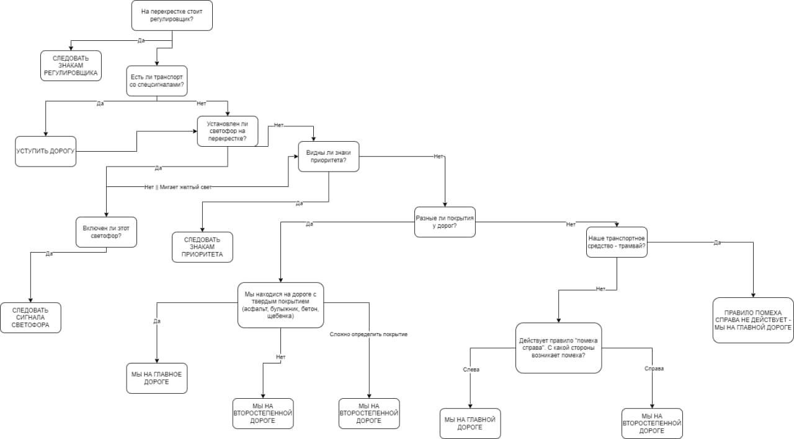

# Отчет по лабораторной работе
## по курсу "Искусственый интеллект"

### Студенты: 

| ФИО       | Роль в проекте                     | Оценка       |
|-----------|------------------------------------|--------------|
| Волков Матвей  |  |          |
| Ляшун Дмитрий |  |       |
| Бирюков Виктор |  |      |
| Воронов Кирилл |  |          |
| Инютин Максим  |  |          |

## Результат проверки

| Преподаватель     | Дата         |  Оценка       |
|-------------------|--------------|---------------|
| Сошников Д.В. |              |               |

> *Комментарии проверяющих (обратите внимание, что более подробные комментарии возможны непосредственно в репозитории по тексту программы)*

## Тема работы

Автопилот - программа получает информацию о ситуации на дороге и выдает рекомендации действий в соответствии с правилами дорожного движения.

## Концептуализация предметной области

Опишите результаты концептуализации предметной области:
 - Выделенные понятия: дорожные события (транспортные средства, ограничения, окружение), характеристики ТС, маневры
 - Тип получившейся онтологии - иерархия
 - Cтатические знания предметной области: дорожная ситуация (знаки на дороге, наличие/отсутствие светофора, ...), характеристики автомобиля  и т. д.
 - Динамические знания предметной области: правила дорожного движения

Онтология:


Пример части экспертной системы (дорожная ситуация - перекресток):


## Принцип реализации системы

Опишите:
 - Какой механизм вывода вы предполагаете использовать и почему
 - Какую систему программирования вы предполагаете использовать и почему
 - Если это имеет смысл, приведите графическую иллюстрацию архитектуры системы. Если система состоит из разных частей (бот, механизм вывода) - опишите принципы интеграции

## Механизм вывода

В нашей работе используется только прямой механизм вывода, поскольку из имеющегося набора фактов (информации о дорожной ситуации) необходимо перейти к заключениям – действиям водителя.  
В библиотеки pyknow механизм вывода строится на основе сформированного экземпляра класса, являющегося подклассом для KnowledgeEngine, хранящего базу знаний – набор условий для вывода новых фактов. В него добавляется набор известных фактов – информации о дорожной ситуации, далее запускается процесс вывода который сообщает о наборе действий, которые необходимо предпринять водителю.  
В качестве примера можно привести реализацию базы знаний для проезда по перекрестку:

```python
from pyknow import *

YES = 'Да'
NO = 'Нет'
FOLLOW_TRAFFIC_LIGHTS = 'Следовать сигналам светофора'
MAIN_ROAD = 'Мы на главной дороге'
NOT_MAIN_ROAD = 'Мы на второстепенной дороге'
CHECK_RIGHT = 'Воспользоваться правилом \"помеха справа\"'
ACTION_GO = 'Можно ехать'
ACTION_GO_LEFT = 'Повернуть налево, иначе остановиться и ждать'
ACTION_GO_RIGHT = 'Повернуть направо, иначе остановиться и ждать'
ACTION_STOP = 'Остановиться и ждать'
ACTION_CHECK_AND_GO = 'Уступить дорогу, если есть другие ТС, иначе можно ехать'

class CrossroadPassage(KnowledgeEngine):
    
    # Если палка смотрит влево, проезжай как королева
    @Rule(AND(Fact(regulator = YES),
              Fact(regulator_direction = 'Влево')))
    def regulator_action_l(self):
        self.declare(Fact(final_action = ACTION_GO))
    
    # Если палка смотрит вправо, ехать не имеешь права
    @Rule(AND(Fact(regulator = YES),
              Fact(regulator_direction = 'Вправо')))
    def regulator_action_r(self):
        self.declare(Fact(final_action = ACTION_STOP))
    
    # Если палка смотрит в рот, делай правый поворот
    @Rule(AND(Fact(regulator = YES),
              Fact(regulator_direction = 'На нас')))
    def regulator_action_o(self):
        self.declare(Fact(final_action = ACTION_GO_RIGHT))
   
    # Если мент стоит спиной, то не рыпайся и стой
    @Rule(AND(Fact(regulator = YES),
              Fact(regulator_direction = 'От нас')))
    def regulator_action_a(self):
        self.declare(Fact(final_action = ACTION_STOP))

    @Rule(AND(Fact(traffic_lights = YES),
              Fact(regulator = NO)))
    def traf_lights_check(self):
        self.declare(Fact(action = FOLLOW_TRAFFIC_LIGHTS))
        
    @Rule(AND(Fact(action = FOLLOW_TRAFFIC_LIGHTS),
              Fact(light = 'Красный')))
    def traf_lights_action_stop(self):
        self.declare(Fact(final_action = ACTION_STOP))
    
    @Rule(AND(Fact(action = FOLLOW_TRAFFIC_LIGHTS),
              Fact(light = 'Зелёный'),
              Fact(light_type = 'Стрелка влево')))
    def traf_lights_action_left(self):
        self.declare(Fact(final_action = ACTION_GO_LEFT))
    
    @Rule(AND(Fact(action = FOLLOW_TRAFFIC_LIGHTS),
              Fact(light = 'Зелёный'),
              Fact(light_type = 'Стрелка вправо')))
    def traf_lights_action_right(self):
        self.declare(Fact(final_action = ACTION_GO_RIGHT))
    
    @Rule(AND(Fact(action = FOLLOW_TRAFFIC_LIGHTS),
              Fact(light = 'Зелёный'),
              NOT(OR(Fact(light_type = 'Стрелка влево'),
                     Fact(light_type = 'Стрелка вправо')))))
    def traf_lights_action_go(self):
        self.declare(Fact(final_action = ACTION_GO))
    
    @Rule(OR(AND(Fact(traffic_lights = NO),
                 Fact(regulator = NO)),
             AND(Fact(action = FOLLOW_TRAFFIC_LIGHTS),
              OR(Fact(light = 'Мигающий жёлтый'),
                 Fact(light = NO))  )))
    def check_prior_signs(self):
        self.declare(Fact(action = 'Проверить знаки приоритета'))
    
    @Rule(AND(Fact(action = 'Проверить знаки приоритета'),
              Fact(prior_signs = YES)))
    def prior_signs_action(self):
        self.declare(Fact(action = 'Следовать знакам приоритета'))
    
    @Rule(AND(Fact(action = 'Следовать знакам приоритета'),
              Fact(prior_sign = 'Главная дорога')))
    def prior_signs_action1(self):
        self.declare(Fact(action = MAIN_ROAD))
    
    @Rule(AND(Fact(action = 'Следовать знакам приоритета'),
              Fact(prior_sign = 'Уступи дорогу')))
    def prior_signs_action2(self):
        self.declare(Fact(action = NOT_MAIN_ROAD))
    
    @Rule(AND(Fact(action = 'Следовать знакам приоритета'),
              Fact(prior_sign = 'Преимущество перед встречным движением')))
    def prior_signs_action3(self):
        self.declare(Fact(action = MAIN_ROAD))
    
    @Rule(AND(Fact(action = 'Следовать знакам приоритета'),
              Fact(prior_sign = 'Преимущество встречного движения')))
    def prior_signs_action4(self):
        self.declare(Fact(action = NOT_MAIN_ROAD))
    
    @Rule(Fact(action = MAIN_ROAD))
    def prior_sign_main_road(self):
        self.declare(Fact(final_action = ACTION_GO))
    
    @Rule(Fact(action = NOT_MAIN_ROAD))
    def prior_sign_not_main_road(self):
        self.declare(Fact(final_action = ACTION_CHECK_AND_GO))
    
    @Rule(AND(Fact(action = 'Проверить знаки приоритета'),
              Fact(prior_signs = NO)))
    def check_road_type(self):
        self.declare(Fact(action = 'Проверить покрытие дороги'))

    @Rule(Fact(my_road = L('Асфальт') | L('Булыжник') | L('Бетон') | L('Щебёнка')))
    def determine_road_type(self):
        self.declare(Fact(road_type = 'Твёрдое покрытие'))
    
    @Rule(AND(Fact(action = 'Проверить покрытие дороги'), Fact(road_type = 'Твёрдое покрытие')))
    def final_check_road_main(self):
        self.declare(Fact(action = MAIN_ROAD))
    
    @Rule(AND(Fact(action = 'Проверить покрытие дороги'), NOT(Fact(road_type = 'Твёрдое покрытие'))))
    def final_check_road_not_main(self):
        self.declare(Fact(action = NOT_MAIN_ROAD))
    
    @Rule(Fact(spec_trans = YES))
    def spec_trans_action(self):
        self.declare(Fact(final_action = 'Уступить дорогу транспорту'))
    
    @Rule(AND(Fact(action = 'Проверить покрытие дороги'), Fact(my_road = W()), Fact(another_road = W()), ))
    def check_trans_type(self):
        self.declare(Fact(action = 'Проверить тип ТС'))
    
    @Rule(AND(Fact(action = 'Проверить тип ТС'), Fact(car_type = 'Трамвай')))
    def check_car_type(self):
        self.declare(Fact(action = MAIN_ROAD))

    @Rule(AND(Fact(action = 'Проверить тип ТС'), NOT(Fact(car_type ='Трамвай'))))
    def use_inter_on_right(self):
        self.declare(Fact(action = CHECK_RIGHT))

    @Rule(AND(Fact(action = CHECK_RIGHT), Fact(inter_side = 'Справа')))
    def final_action3(self):
        self.declare(Fact(action = NOT_MAIN_ROAD))
    
    @Rule(AND(Fact(action = CHECK_RIGHT), Fact(inter_side = 'Слева')))
    def final_action4(self):
        self.declare(Fact(action = MAIN_ROAD))
    
    
    
    def factz(self,l):
        for x in l:
            self.declare(x)
    
    @Rule(Fact(final_action = MATCH.action), salience = 1)
    def what_to_do(self, action):
        print(action)
```

## Извлечение знаний и база знаний

Опишите, как происходило извлечение знаний, с учётом совместной работы над проектом. Приведите фрагменты представления знаний: дерево И-ИЛИ, наиболее интересные правила. 

## Протокол работы системы

Для демонстрации работы системы используется генератор тестов.

Перекрёстки:
```
[Fact(regulator='Да'), Fact(regulator_direction='Вправо'), Fact(traffic_lights='Нет'), Fact(light='Мигающий жёлтый'), Fact(light_type='Стрелка влево'), Fact(prior_signs='Да'), Fact(prior_sign='Главная дорога'), Fact(my_road='Асфальт'), Fact(car_type='Мотоцикл')]
--
Остановиться и ждать
--
[Fact(regulator='Да'), Fact(regulator_direction='На нас'), Fact(traffic_lights='Да'), Fact(light='Зелёный'), Fact(light_type='Нет стрелки'), Fact(prior_signs='Да'), Fact(prior_sign='Преимущество встречного движения'), Fact(my_road='Щебёнка'), Fact(car_type='Велосипед')]
--
Повернуть направо, иначе остановиться и ждать
--
[Fact(regulator='Да'), Fact(regulator_direction='Влево'), Fact(traffic_lights='Да'), Fact(light='Мигающий жёлтый'), Fact(light_type='Стрелка вправо'), Fact(prior_signs='Нет'), Fact(prior_sign='Преимущество встречного движения'), Fact(my_road='Щебёнка'), Fact(car_type='Автомобиль')]
--
Можно ехать
--
[Fact(regulator='Нет'), Fact(regulator_direction='Вправо'), Fact(traffic_lights='Да'), Fact(light='Зелёный'), Fact(light_type='Нет стрелки'), Fact(prior_signs='Да'), Fact(prior_sign='Преимущество встречного движения'), Fact(my_road='Грязь'), Fact(car_type='Мотоцикл')]
--
Можно ехать
--
[Fact(regulator='Нет'), Fact(regulator_direction='От нас'), Fact(traffic_lights='Да'), Fact(light='Нет'), Fact(light_type='Нет стрелки'), Fact(prior_signs='Нет'), Fact(prior_sign='Главная дорога'), Fact(my_road='Бетон'), Fact(car_type='Трамвай')]
--
Можно ехать
--
```

Навигатор:
```
[Fact(navigator_direction='Назад'), Fact(forbidden_sign='Да'), Fact(ban_on_turning='Да'), Fact(one_way_traffic='Нет'), Fact(stop_15_meters='Да')]
--
Развернуться на ближайшем перекрёстке
--
```

## Выводы

Выполнив данную лабораторную работу, мы получили интересный опыт в работе в команде. Всё началось с выбора темы, рассматривалось очень много вариантов, например, анализатор ошибок на атомной электростанции (этот вариант откинули из-за сложности самой области), рекомендации автомобилей, комплектующих компьютера и многое другое. Но решили остановаться на достаточно интересной, и, как нам показалось, актуальной теме - автопилот. Предполагалось, что  информация, которую анализирует наша система, может поступать, например, с помощью компьютерного зрения. И в итоге наш искусственный интеллект выдаёт рекомендации водителю как поступать, не нарушая правила дорожного движения. Были даже идеи, что экспертная система полностью возьмёт под контроль движение машины, но для этого нужно гараздо больше данных, и работа окажется намного сложнее. Следующая трудность, с которой мы столкнулись - составление плана действий и распределение деятельности. Тут у нас происходило всё как-то хаотично: решения приходили и принимались спантанно, по мере изучения документации для pyknow. Но всё-таки получилась некая полная картина. С поставленной задачей мы справились. После того, как каждый понял, что надо делать, проблем не возникало и результат был достигнут. Данная работа научила нас создавать экспертные системы, работать в команде, а также находить оригинальные выходы из разных ситуаций. 
