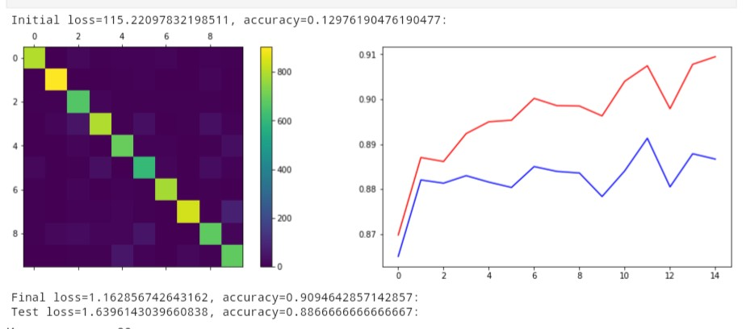
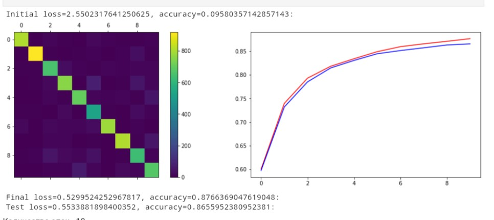
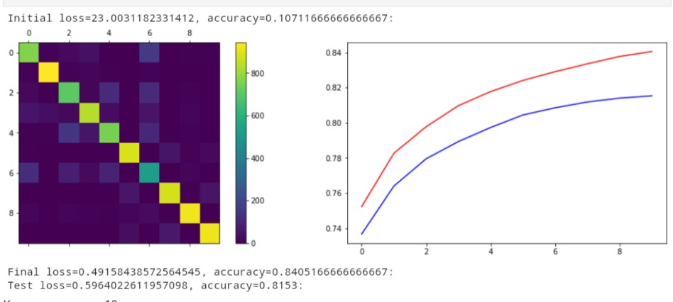
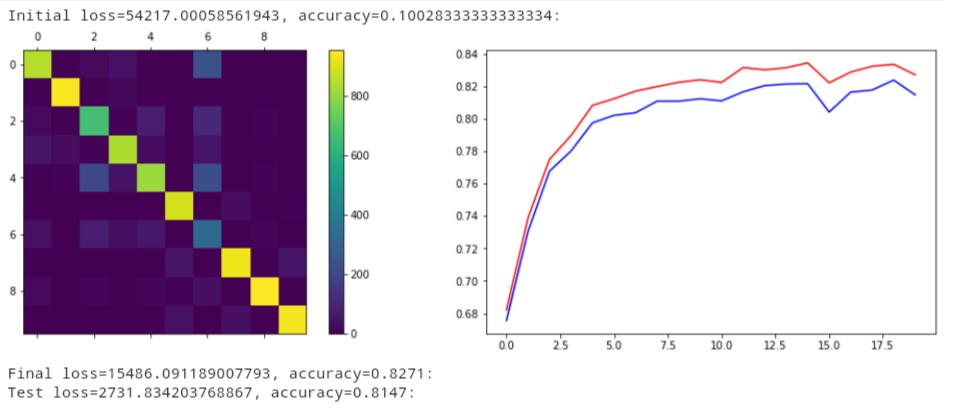
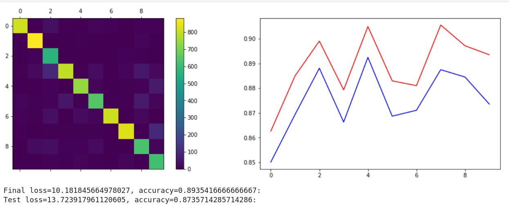
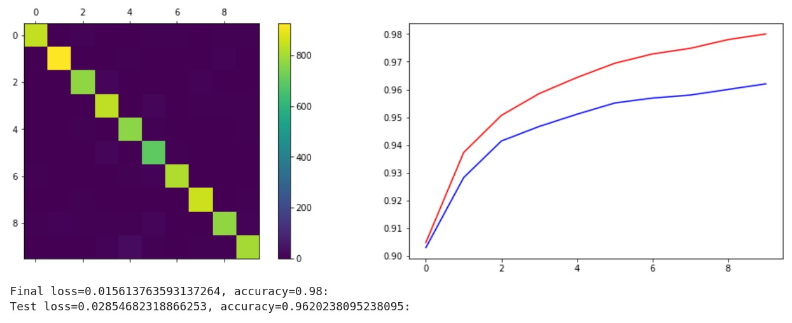
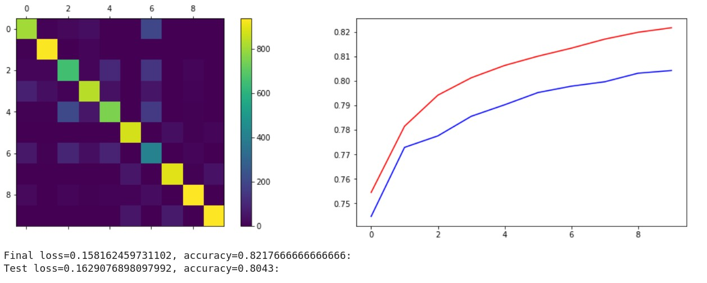
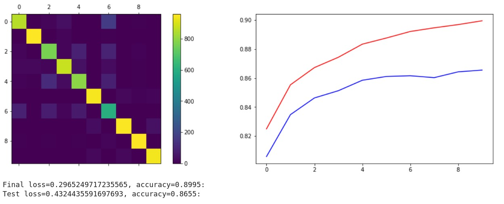
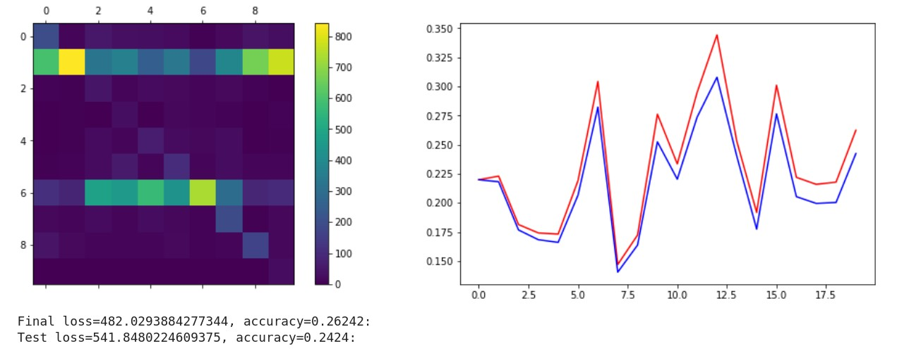
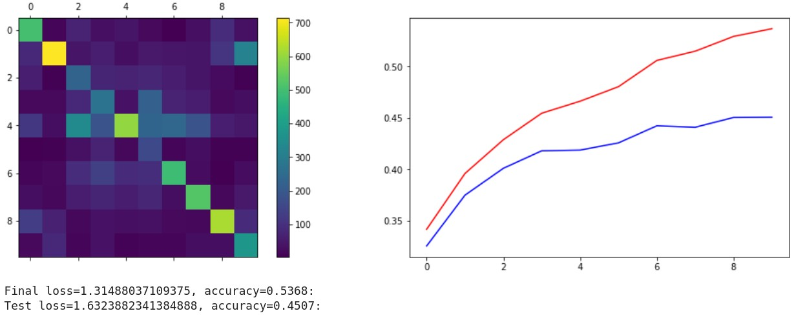

# Лабораторная работа по курсу "Искусственный интеллект"
# Многослойный персептрон

| Студент | Воронов Кирилл Михайлович |
|------|------|
| Группа  | М8О-307Б-19 |
| Оценка 1 (свой фреймворк) | *X* |
| Оценка 2 (PyTorch/Tensorflow) | *X* |
| Проверил | Сошников Д.В. |

> *Комментарии проверяющего*
### Задание

Решить задачу классификации для датасетов MNIST, FashionMNIST, CIFAR-10 с помощью 1, 2 и 3-слойного персептрона. Попробовать разные передаточные функции, провести сравнительную оценку решений. Решение сделать двумя способами:
* "С нуля", на основе базовых операций библиотеки numpy. Решение желательно реализовать в виде библиотеки, пригодной для решения более широкго круга задач.
* На основе одного из существующих нейросетевых фреймворков, в соответствии с вариантом задания:
   1. PyTorch
   1. Tensorflow/Keras

> *Номер варианта вычисляется по формуле 1 + (N-1) mod 2, где N - номер студента в списке.*

Решение оформить в файлах [Solution_MyFramework.ipynb](Solution_MyFramework.ipynb) и [Solution.ipynb](Solution.ipynb). 
Отчет по работе и сравнение методов пишется в этом файле после задания.
### Критерии оценки

Первая часть лабораторной работы:

| Сделано | Баллы |
|---------|-------|
| Реализован однослойный персептрон, классифицирующий датасет с точностью >85% | 1 |
| Реализован многослойный персептрон, классифицирующий датасет с точностью >85% | 2 |
| Реализация сделана как библиотека для обучения сетей различных конфигураций, в соответствии с примером | 1 |
| Улучшена архитектура библиотеки, отдельно вынесены алгоритмы обучения, функции потерь | 3 |
| Проведено сравнение различных гиперпараметров, таких, как передаточные функции, число нейронов в промежуточных слоях, функции потерь, с графиками обучения и матрицами неточности | 2 |
| Проведен анализ для датасета FashionMNIST | 1 |

Вторая часть лабораторной работы:

| Сделано | Баллы |
|---------|-------|
| Реализован однослойный персептрон, классифицирующий датасет с точностью >85% | 1 |
| Реализован многослойный персептрон, классифицирующий датасет с точностью >85% | 2 |
| Реализация использует возможности базового фреймворка, включая работу с данными | 3 |
| Проведено сравнение различных гиперпараметров, таких, как передаточные функции, число нейронов в промежуточных слоях, функции потерь, с графиками обучения и матрицами неточности | 2 |
| Проведен анализ для датасета FashionMNIST | 1 |
| Проведен анализ для другого датасета с цветными картинками (CIFAR-10) | 1 |

## Отчёт по работе

Отчёт, помимо общего описания решения, должен включать:
* График точности на обучающей и проверочной выборке в процессе обучения
* Confusion Matrix
* Сравнение полученных показателей точности модели для различных гиперпараметров (передаточных функций, числа нейронов в слоях и т.д.)

## Часть 1

В данной части лабораторной работы реализована библиотека Net, которая принимает
- Функцию потерь
- Алгоритм обучения
- Слой
- Предаточную функцию

С её помощью происходит тестирование нейросетей с различными параметрами. Также реализованы :
- Функция потерь Cross Entropy Loss
- Функция потерь Mean Square Error
- Линейный слой Linear 
- Предаточная функция Tanh
- Предаточная функция ReLU
- Функция Softmax
- Метод наискорейшего градиентного спуска

В библиотеке Net, помимо прочих функций, присутствуют train_epoch - одна эпоха и train, которая принимает данные и параметры, такие как количество эпох, размер батча и шаг градиента. Тестирование пооводилось на данных MNIST и Fashion MNIST.

### MNIST

Однослойная, CrossEntropyLoss

Двухслойная, ReLU, CrossEntropyLoss

### FashionMNIST

Трёхслойная, ReLU, CrossEntropyLoss

Трёхслойная, Tanh, MeanSquareError

### Выводы
Выполняя данную часть лабораторной работы, я получил много новоых навыков. Было очень интересно не только узнать, как работают нейросети, но и реализовать, обучать их. Сразу стало заметно, что для этого надо немало ресурсов. Нейросеть обучалась очень долго, вплоть до 10-12 минут и процессор работал на 100%. Пришлось обратиться к облачным ресурсам, таким как Github Codespaces (в итоге он не отображал и не загружал файлы с расширением .ipynb, поэтому работать там не оказалось возможным) и Google Colab, хотя скорость обучения там не намного уменьшилась. Также было интересно позапускать нейросеть с различными параметрами и посмотреть, как те или иные работают вместе. Какие-то комбинации были лучше, какие-то хуже. Лучшая точность, которая у меня получилась, варируется от 80% до 90%. Делая работу, задумался над применением нейросетей. Сначала подумалось, что это никуда не годится, так как ошибка даже в 10% существенна, в отличие от обычных алгоритмов, которые всегда выдают правильный ответ. Но потом пришла мысль, что это может использоваться в Data Science, где все построенно на математической статистике, и без ошибок там не обойтись. Да и вообще, сама идея, что компьютер может выполнять какие-то действия, которые может человек, основываясь на математике, очень удивляет и воодушевляет.

## Часть 2
В данной части лабораторной работе использована библиотека PyTorch. 
Применялись различные функции потерь (cross_entropy, mse_loss, multilabel_soft_margin_loss, poisson_nll_loss), алгоритмы оптимизации (Adam, Adagrad, RMSprop, Adadelta), предаточные функции (ReLU, ReLU6, Sigmoid), а также изменялись шаг обучения, количество слоев и размер батча. Основная функция для тренировки - train, которая принимает соответствующие параметры. Также реализованы функции acc_loss, которая считает точность, и make_target, которая изменяет формат храниения ответов для корректной работы функций PyTorch. Тестирование пооводилось на данных MNIST, Fashion MNIST и CIFAR-10.

### MNIST

Однослойная, Adam, cross_entropy

Трёхслойная, RMSprop, ReLU, cross_entropy

### FashionMNIST

Двухслойная, Adagrad, ReLU6, poisson_nll_loss

Трёхслойная, RMSprop, ReLU, cross_entropy

### CIFAR-10

Однослойная, Adagrad, cross_entropy

Трёхслойная, RMSprop, ReLU, cross_entropy

### Выводы
Данная часть лабораторной работы позволила мне использовать больше различных параметров для обучения из библиотки PyTorch и наблюдать, как те или иные влияют на обучение нейросети. В начале возникли проблемы с реализацией модели обучения и использования различных функций PyTorch (например, пришлось переделывать формат правильных ответов), но потом все оказалось довольно интересно и нетрудно, после ввода различных параметров приходилось только ждать результатов. В этот раз я также воспользовался Google Colab. К сожалению, для цветных картинок (CIFAR-10) результаты были менее впечатляющими, чем для чёрно-белых. Максимальную точность, которую мне получалось достичь - 45% правильных ответов. Однако для остальных результаты были более примемлимые, для цифр я даже достиг точности в 96%. Данная лабораторная работа была интересна и познавательна. Я не только сам реализовал нейросеть, но также научился взаимодействовать со стандартной библиотекой. Думаю, мне это пригодится в будущем.

## Codespaces

По возможности, используйте GitHub Codespaces для выполнения работы. По результатам, дайте обратную связь:
1. Что понравилось?
1. Что не понравилось?
1. Какие ошибки или существенные затруднения в работе вы встречали? (По возможности, будьте как можно более подробны, указывайте шаги для воспроизведения ошибок)

## Материалы для изучения

 * [Реализация своего нейросетевого фреймворка](https://github.com/shwars/NeuroWorkshop/blob/master/Notebooks/IntroMyFw.ipynb)
 * [Введение в PyTorch](https://github.com/shwars/NeuroWorkshop/blob/master/Notebooks/IntroPyTorch.ipynb)
 * [Введение в Tensorflow/Keras](https://github.com/shwars/NeuroWorkshop/blob/master/Notebooks/IntroKerasTF.ipynb)
