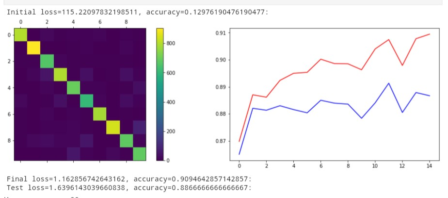
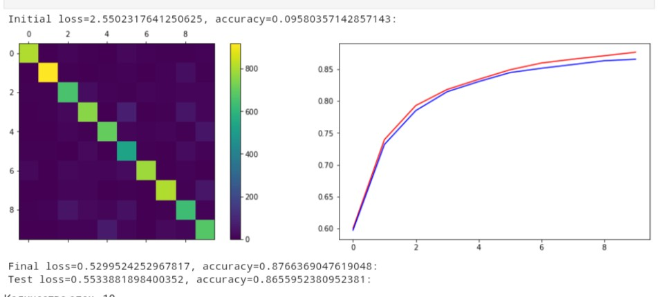
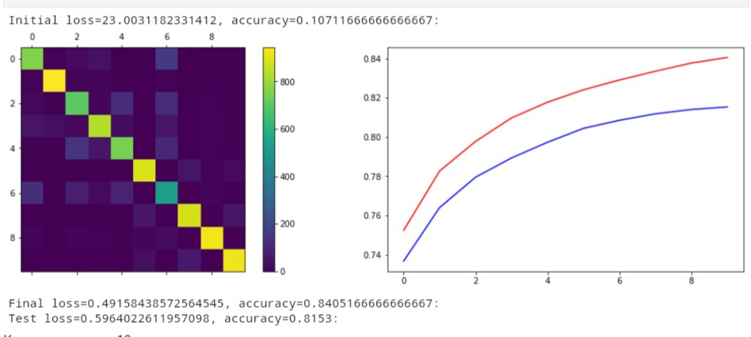

# Отчет по лабораторной работе по курсу "Искусственный интеллект"
# Многослойный персептрон

Воронов Кирилл Михайлович, М8О-307Б-19

## Часть 1

В данной части лабораторной работы реализована библиотека Net, которая принимает
- Функцию потерь
- Алгоритм обучения
- Слой
- Предаточную функцию

С её помощью происходит тестирование нейросетей с различными параметрами. Также реализованы :
- Функция потерь Cross Entropy Loss
- Функция потерь Mean Square Error
- Линейный слой Linear 
- Предаточная функция Tanh
- Предаточная функция ReLU
- Функция Softmax
- Метод наискорейшего градиентного спуска

В библиотеке Net, помимо прочих функций, присутствуют train_epoch - одна эпоха и train, которая принимает данные и параметры, такие как количество эпох, размер батча и шаг градиента. Тестирование пооводилось на данных MNIST и Fashion MNIST.

### MNIST

Однослойная, CrossEntropyLoss

Двухслойная, ReLU, CrossEntropyLoss

### FashionMNIST

Трёхслойная, ReLU, CrossEntropyLoss

Трёхслойная, Tanh, MeanSquareError

### Выводы
Выполняя данную лабораторную работу, я получил много новоых навыков. Было очень интересно не только узнать, как работают нейросети, но и реализовать, обучать их. Сразу стало заметно, что для этого надо немало ресурсов. Нейросеть обучалась очень долго, вплоть до 10-12 минут и процессор работал на 100%. Пришлось обратиться к облачным ресурсам, таким как Github Codespaces (в итоге он не отображал и не загружал файлы с расширением .ipynb, поэтому работать там не оказалось возможным) и Google Colab, хотя скорость обучения там не намного уменьшилась. Также было интересно позапускать нейросеть с различными параметрами и посмотреть, как те или иные работают вместе. Какие-то комбинации были лучше, какие-то хуже. Лучшая точность, которая у меня получилась, варируется от 80% до 90%. Делая работу, задумался над применением нейросетей. Сначала подумалось, что это никуда не годится, так как ошибка даже в 10% существенна, в отличие от обычных алгоритмов, которые всегда выдают правильный ответ. Но потом пришла мысль, что это может использоваться в Data Science, где все построенно на математической статистике, и без ошибок там не обойтись. Да и вообще, сама идея, что компьютер может выполнять какие-то действия, которые может человек, основываясь на математике, очень удивляет и воодушевляет.

