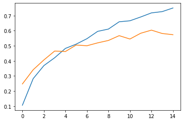
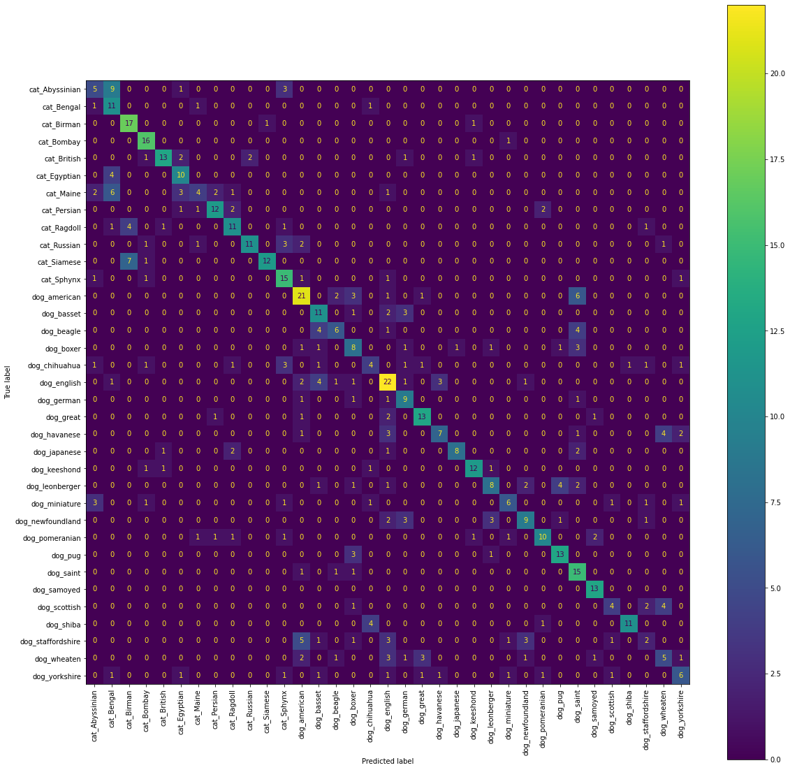
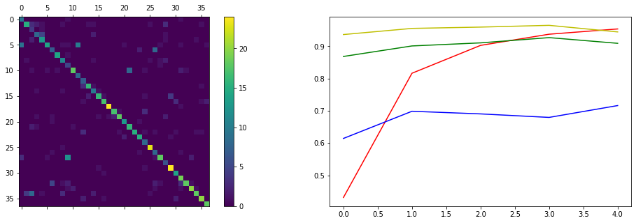
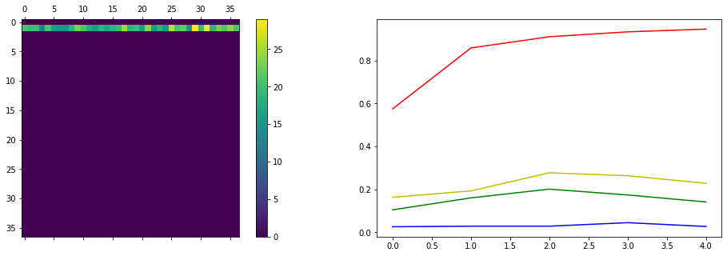
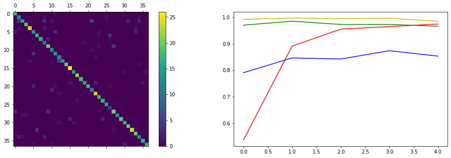
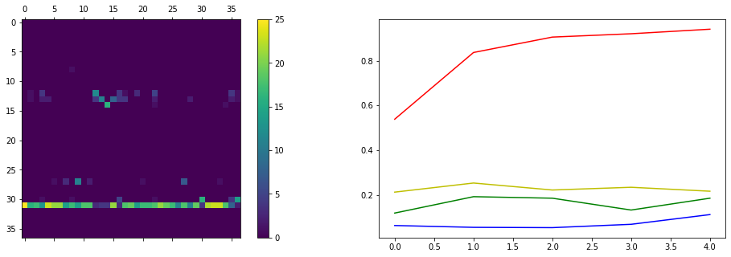

[](https://classroom.github.com/online_ide?assignment_repo_id=7812442&assignment_repo_type=AssignmentRepo)
# Лабораторная работа по курсу "Искусственный интеллект"
# Классификация изображений.

| Студент | Воронов Кирилл Михайлович |
|------|------|
| Группа  | 7 |
| Оценка 1 (обучение "с нуля") | *X* |
| Оценка 2 (transfer learning) | *X* |
| Проверил | Сошников Д.В. |

> *Комментарии проверяющего*
### Задание

Решить задачу классификации пород кошек и собак на основе датасета [Oxford-IIIT](https://www.robots.ox.ac.uk/~vgg/data/pets/).


#### Задание 1: Классификация Pet Faces

Обучить свёрточную нейронную сеть для классификации пород кошек и собак на основе упрощённого датасета **Pet Faces**. Самостоятельно придумать архитектуру сети, реализовать предобработку входных данных.

Для загрузки датасета используйте следующий код:

```python
!wget https://mslearntensorflowlp.blob.core.windows.net/data/petfaces.tar.gz
!tar xfz petfaces.tar.gz
!rm petfaces.tar.gz
```

В качестве результата необходимо:

* Посчитать точность классификатора на тестовом датасете
* Посчитать точность двоичной классификации "кошки против собак" на текстовом датасете
* Построить confusion matrix
* **[На хорошую и отличную оценку]** Посчитайте top-3 accuracy
* **[На отличную оценку]** Выполнить оптимизацию гиперпараметров: архитектуры сети, learning rate, количества нейронов и размеров фильтров.

Решение оформите в файле [Faces.ipynb](Faces.ipynb).

Использовать нейросетевой фреймворк в соответствии с вариантом задания:
   * Чётные варианты - PyTorch
   * Нечётные варианты - Tensorflow/Keras
#### Задание 2: Классификация полных изображений с помощью transfer learning

Используйте оригинальный датасет **Oxford Pets** и предобученные сети VGG-16/VGG-19 и ResNet для построение классификатора пород. Для загрузки датасета используйте код:

```python
!wget https://mslearntensorflowlp.blob.core.windows.net/data/oxpets_images.tar.gz
!tar xfz oxpets_images.tar.gz
!rm oxpets_images.tar.gz
```

В качестве результата необходимо:

* Посчитать точность классификатора на тестовом датасете отдельно для VGG-16/19 и ResNet, для дальнейших действий выбрать сеть с лучшей точностью
* Посчитать точность двоичной классификации "кошки против собак" на текстовом датасете
* Построить confusion matrix
* **[На отличную оценку]** Посчитайте top-3 и top-5 accuracy

Решение оформите в файле [Pets.ipynb](Pets.ipynb).

Использовать нейросетевой фреймворк, отличный от использованного в предыдущем задании, в соответствии с вариантом задания:
   * Нечётные варианты - PyTorch
   * Чётные варианты - Tensorflow/Keras

## Отчёт
В данной лабораторной работе реализованы сверточная сеть с "нуля" и с помощью transfer learning. Во время выполнения работы я пользовался Google Colab, так как там предоставляется GPU.  В качетве фреймворка мне достался Tensorflow/Keras, как мне показалось, очень удобный. С помощью него я реализовал сеть с тремя фильтрами и четырьмя линейными слоями. Данная модель получилась самая эффективная среди всех, которые я пробовал, и имеет точность в районе 58-60%. В качестве функций активации я использовал тангенс и ReLU, а функции потерь - categorical crossentropy. Алгоритм оптимизации - Adam с learnig rate = 0.0001.
Результаты по 15-ти эпохам следующий:



ConfusionMatrix



Точность по определению вида животного (кошка собака) составила почти 90%.


Во второй части использовались такие предобученные модели, как vgg16 и resnet. Обучение происходило с использованием фреймворка PyTorch, базу для которого я взял из своей прошлой лабораторной.  Для vgg16 я взял стандартный классификатор, который уже был там заложен, и получил приемлемые результаты. Точность достигла 71% по породам и 97% по виду.



Для resnet все оказалось довольно хуже. Как я не пытался изменить структуру модели или поменять вариант resnet, на тренировочных данных он показывает себя очень плохо, точность не растет и достигает 3-5%.  Для вида животного она составляет 69%.



После этого я нашел, что для этих моделей нужно по-особому делать нормализацию, а именно использовать

torchvision.transforms.Normalize([0.485, 0.456, 0.406], [0.229, 0.224, 0.225])

Это улучшило ситуацию, vgg16 достиг точности в 86% по породам и 99.7% по виду. Однако resnet все еще показывает плохие результаты, 11% по породам и 69.7% по виду.





### Выводы
Выполнив данную лабораторную работу я получил интересный опыт, связанный с реализацией и использованием сверточных сетей. Как видно, такого рода сети имеют намного больше возможностей по распознованию картинок, чем обычные, так как с помощью фильтров они выделяют на картинках различного рода мини-штрихи и прочее, что помогает им классифицировать объекты.  Но такие возможности очень сказываются на производительности. Сети требуют очень много ресурсов при обучении, с чем я непосредственно столкнулся при выполнении. Меня очень удивило, что сеть resnet не обучается, но так как в связи с большой нагрузкой мне катастрофически  не хватает времени, доразобраться я так и не смог. В любом случае, можно использовать vgg16, который работает намного лучше. В целом лабораторная была интересная, но, как уже говорил выше, из-за большого недостатка времени и нагруженности, полностью получить удовольствие от процесса не получилось. 


## Codespaces

По возможности, используйте GitHub Codespaces для выполнения работы. По результатам, дайте обратную связь:
1. Что понравилось?
1. Что не понравилось?
1. Какие ошибки или существенные затруднения в работе вы встречали? (По возможности, будьте как можно более подробны, указывайте шаги для воспроизведения ошибок)

## Материалы для изучения

* [Deep Learning for Image Classification Workshop](https://github.com/microsoft/workshop-library/blob/main/full/deep-learning-computer-vision/README.md)
* [Convolutional Networks](https://github.com/microsoft/AI-For-Beginners/blob/main/4-ComputerVision/07-ConvNets/README.md)
* [Transfer Learning](https://github.com/microsoft/AI-For-Beginners/blob/main/4-ComputerVision/08-TransferLearning/README.md)
